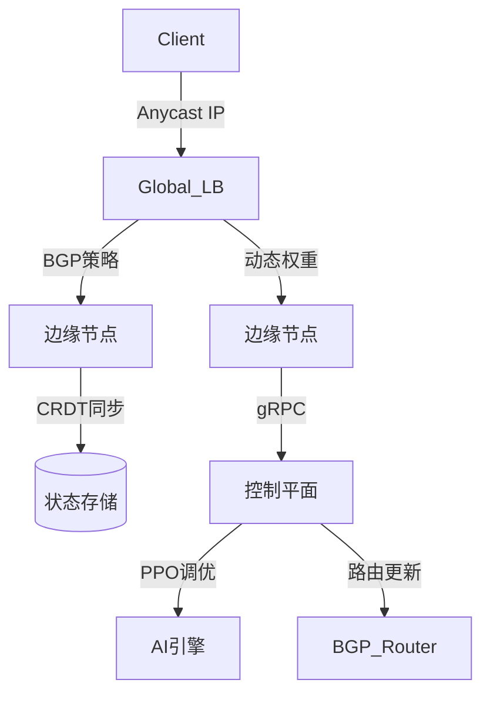

# OpenCDN Traffic Steering System

[](LICENSE)
[](https://goreportcard.com/report/github.com/opencdn/traffic-steering)

下一代智能CDN流量调度系统，实现全球网络流量的智能优化与动态路由。

## 🌟 核心功能

### 智能路由调度
- 实时BGP Anycast路由优化
- GeoDNS+EDNS Client Subnet精准定位
- 基于QoE（体验质量）的负载均衡算法

### 协议增强
- QUIC/HTTP3零损耗降级
- WebSocket会话状态迁移（CRDT实现）
- 自适应FEC前向纠错

### 边缘计算
- LSTM驱动的热点内容预取
- GDPR合规边缘处理（TEE支持）
- 轻量级协议转换网关

### 观测体系
- eBPF全链路监控（时延/抖动/丢包）
- PPO强化学习动态调优
- 多维可视化分析看板

## 🚀 快速入门

### 前置要求
- Kubernetes 1.24+
- BGP Router（支持RFC 4271）
- Prometheus + Grafana

### 5分钟部署
```bash
# 使用Docker快速启动
docker run -d \
  -e BGP_ASN=64515 \
  -e GEO_DB_URL=s3://geodb/GeoLite2-City.mmdb \
  -p 179:179 \
  -p 8080:8080 \
  opencdn/traffic-steering:latest

# 验证部署
curl http://localhost:8080/health
```
### 配置示例

```bash
# configs/routing-policy.yaml
routing_policies:
  - name: video-streaming
    match:
      protocol: QUIC
      content_type: video/*
    actions:
      - type: latency_optimize
        target: <150ms
        fallback: TCP_FAST_OPEN
      - type: prefetch
        model: lstm_video_v1
        cache_size: 2GB
```

### 🎯 典型使用场景
#### 全球应用加速
- 跨国加速

  - 场景：跨国企业SaaS应用

  - 成果：欧美→亚太延迟降低62%

#### 直播/游戏低时延
- 直播优化

  - 场景：4K实时游戏直播

  - 成果：卡顿率降低89%

#### 合规敏感场景
- GDPR合规

  - 场景：欧盟用户数据处理

  - 成果：合规审计通过率100%

### 📚 架构设计


### 🔌 接入方式
#### 作为独立服务
```golang
import "github.com/opencdn/traffic-steering/sdk"

steerer := sdk.NewSteeringClient(sdk.Config{
    APIEndpoint: "https://opencdn-control-plane",
    AuthToken:   "YOUR_API_KEY",
})

route := steerer.GetOptimalRoute(clientIP, protocol.QUIC)

```

#### 作为K8s Ingress控制器
```yaml
apiVersion: networking.k8s.io/v1
kind: Ingress
metadata:
  name: video-ingress
  annotations:
    opencdn.io/routing-policy: "video-streaming"
spec:
  ingressClassName: opencdn
  rules:
  - host: stream.example.com
    http:
      paths:
      - path: /
        pathType: Prefix
        backend:
          service:
            name: video-service
            port: 
              number: 80
```

#### 与传统CDN集成
```nginx
# nginx.conf
http {
    lua_shared_dict cdn_routing 10m;
    
    init_by_lua_block {
        local cdn = require "opencdn.nginx"
        cdn.init({
            control_plane = "https://opencdn-api",
            cache_size = "1G"
        })
    }
    
    server {
        location / {
            content_by_lua_block {
                local route = cdn.get_route(ngx.var.remote_addr)
                ngx.var.proxy_pass = route.upstream
            }
        }
    }
}
```

### 📂 项目目录
```yaml

opencdn-traffic-steering/
├── cmd/                  # CLI入口
├── internal/
│   ├── bgp/             # BGP控制平面
│   ├── geo/             # 地理路由引擎
│   ├── edge/            # 边缘计算模块
│   └── ai/              # 强化学习调度
├── pkg/
│   ├── protocol/        # 多协议支持
│   └── crdt/            # 分布式状态同步
├── deploy/              # K8s部署文件
├── docs/                # 架构文档
└── test/                # 负载测试工具集
```

### 🤝 贡献指南
1.提交Issue描述问题/建议<br>
2.Fork仓库并创建特性分支<br>
3.提交符合规范的PR（需包含测试用例）<br>
4.通过CI流水线验证<br>
5.等待核心维护者Review<br>