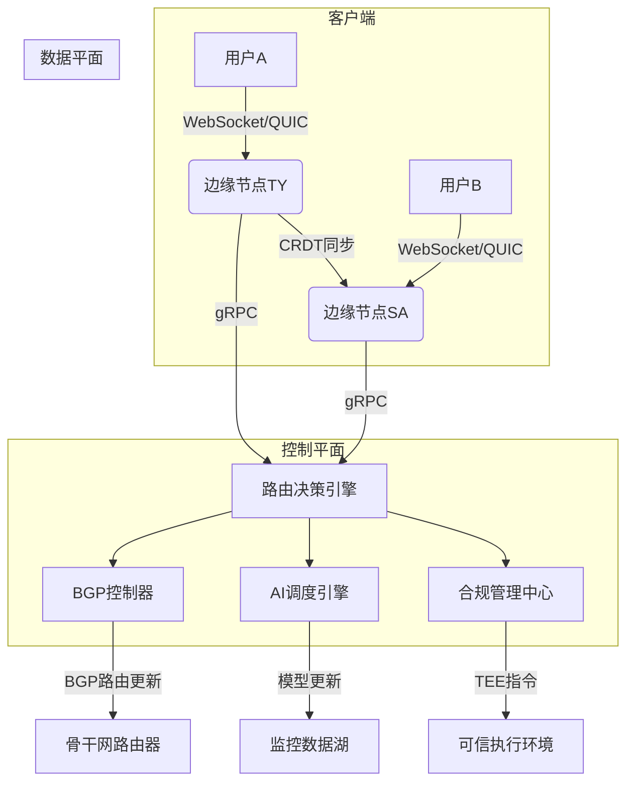
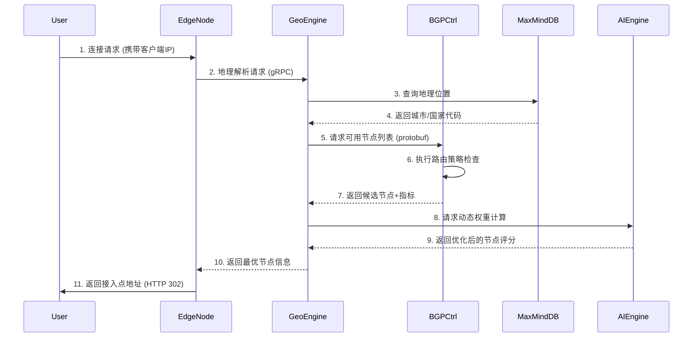
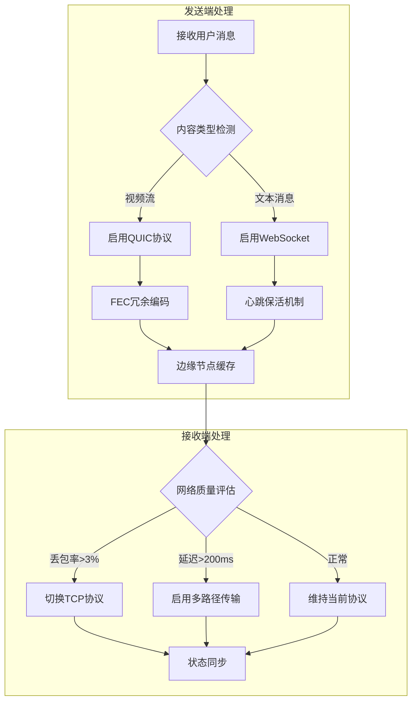
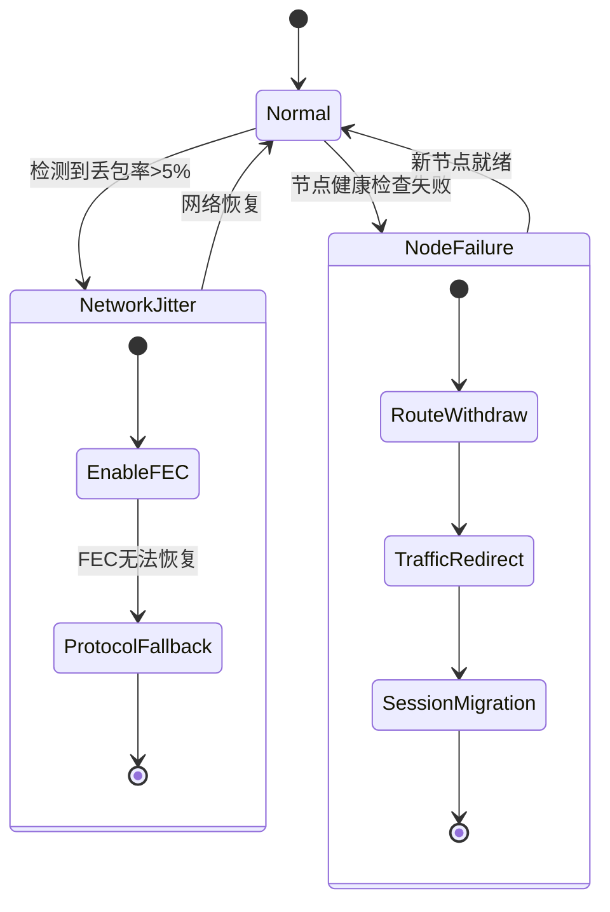
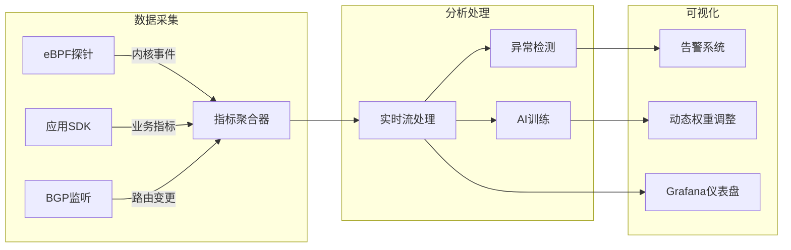

# OpenCDN 系统架构交互流程文档

## 🌐 全局架构概览


## 🔄 核心交互流程详解
### 1. 用户接入与路由决策

#### 关键技术点：
- 使用EDNS Client Subnet传递客户端真实IP
- BGP控制器集成实时RIB(路由信息库)
- AI引擎基于PPO算法计算节点权重：
```python
def calculate_score(latency, loss, load):
    return 0.4*(1 - latency/500) + 0.3*(1 - loss) + 0.3*(1 - load) 
```

### 2. 消息传输与协议优化


#### 协议切换逻辑：
```go
func ProtocolSwitch(conn *Connection) {
    metrics := GetNetworkMetrics(conn.ID)
    if metrics.LossRate > 0.03 {
		conn.SwitchTo(TCP)
    } else if metrics.RTT > 200 {
		conn.EnableMultipath()
    }
    // 状态迁移保证
    MigrateSessionState(conn)
}
```

### 3. 异常处理与容灾机制



#### 容灾操作步骤
**1.路由撤回**：通过BGP UPDATE消息通知全网
```bash
gobgp global rib del 192.168.1.0/24
```

**2.流量重定向**：更新GeoDNS权重分配
**3.会话迁移**：使用CRDT算法同步状态

```go
crdt.Merge(stateA, stateB, func(conflict){
    return conflict.HighestTimestamp()
})
```
## 📊 监控与优化体系
### 全链路监控架构

#### 关键监控指标：

---
指标类型	&nbsp;&nbsp;&nbsp;&nbsp;  采集频率&nbsp;&nbsp;&nbsp;&nbsp;	 告警阈值

---
节点CPU使用率&nbsp;&nbsp;&nbsp;&nbsp;	10s&nbsp;&nbsp;&nbsp;&nbsp;	>80% 持续5分钟

---
跨境时延(P95)&nbsp;&nbsp;&nbsp;&nbsp;1min	&nbsp;&nbsp;&nbsp;&nbsp;>500ms

---
WebSocket重连率&nbsp;&nbsp;&nbsp;&nbsp;	30s&nbsp;&nbsp;&nbsp;&nbsp;	>5%

---
BGP路由震荡次数&nbsp;&nbsp;&nbsp;&nbsp;	实时&nbsp;&nbsp;&nbsp;&nbsp;	>10次/分钟

---

## 🛠️ 开发者指南
### 本地调试环境搭建
```bash
# 启动最小化集群
docker-compose -f deploy/docker-compose-dev.yaml up

# 运行集成测试
go test -v ./test/integration -tags=integration

# 性能剖析示例
curl http://localhost:6060/debug/pprof/profile?seconds=30 > cpu.pprof
go tool pprof cpu.pprof
```

### 扩展开发示例：添加新协议
1.在pkg/protocol创建新协议包
2.实现Protocol接口：
```go
type MyProtocol struct {
    // 实现必要方法
}

func (p *MyProtocol) Migrate(conn *Conn) error {
    // 协议特定迁移逻辑
}
```

3.注册到协议管理器：
```go
protocol.Register("myproto", &MyProtocol{})
```


